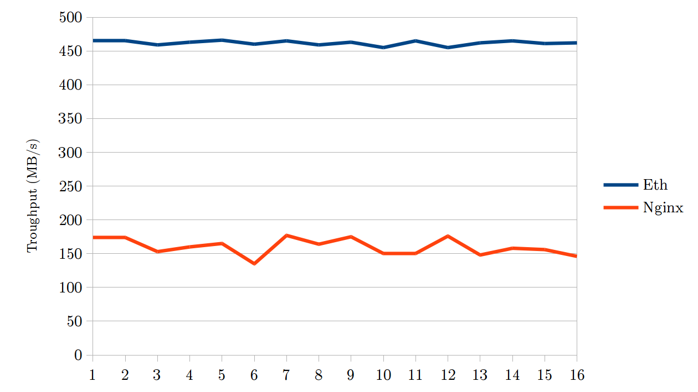

# Eth: extreme throughput http daemon
A specialized web server with userspace TCP/IP stack.
Also my undergraduate thesis work.

## What?
Eth is a specialized web server whose aim is to be extremely fast on static file
serving. It archives this using Netmap and a custom lightweight TCP/IP stack
written from scratch specifically for the HTTP protocol.

## Give me numbers
Currently I can only test it with a virtual machine.

Some numbers: average speed to download a 1GB file with a single connection.

* tests are run on a QEMU virtual machine with an emulated Intel e1000 NIC (attached to the network with a TAP interface)
* the real machine is a laptop:
	* Intel i5-4288U CPU (2.88 Ghz)
	* 8GB of memory
	* 512 GB of SSD
* the OS is ArchLinux (both the host and the guest)
* Nginx uses the default configuration

Nginx | Eth
--- | ---
160 Mb/s | 460 Mb/s



and because this is a work in progress (and a big proof of concept at the
moment) I think Eth performance can further be improved (TCP offload, better
data structures, ..).

##Installation

### Steps:
clone the repo
```
$ git clone --recursive git@github.com:jibi/eth.git
```
build dependencies (Netmap).

Note: you need the kernel sources of your running kernel to be in the
`/usr/src/linux` directory.

```
$ make deps
```

build Eth

```
$ make
```

load Netmap module
```
# insmod deps/netmap/LINUX/netmap.ko
```

set interface up

```
# ifconfig $if up
```

and start Eth server with

```
# ./eth --dev $ifname --mac $ifmac --ip $ifip --port $port
```

